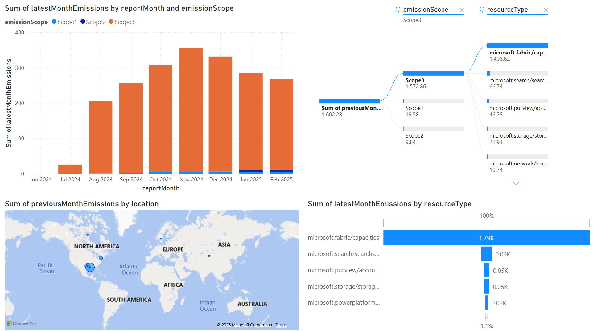

# Automated Microsoft Azure Carbon Emissions Pipeline to Fabric

This script pulls carbon emissions data from the [Azure Carbon Optimization API](https://learn.microsoft.com/en-us/azure/carbon-optimization/api-export-data) and loads it into a Microsoft Fabric Lakehouse using a Service Principal.

---

## 🚀 What It Does

- Pulls the `ItemDetailsReport` from the Azure Carbon Optimization API
- Iterates over the last 12 months (ending 2 months ago) for Scope1, Scope2, and Scope3
- Automatically skips months already ingested
- Writes to a Fabric Lakehouse Delta table (and creates table if it doesn't exist)
- Adds consistent schema and metadata columns (`reportMonth`, `emissionScope`)

---

## 🛠 Setup Requirements

You’ll need:

- Access to [Microsoft Fabric](https://learn.microsoft.com/en-us/fabric/) and a lakehouse
- An Azure tenant with carbon emissions data
- A Service Principal configured to call the API from the tenant

---

## 🔐 Azure Setup: Service Principal

1. **Create App Registration**
   - Azure Portal → Azure Active Directory → App registrations → New registration
   - Name it something like `FabricCarbonReader`
   - Copy the **Application (client) ID**

2. **Create a Client Secret**
   - Under Certificates & Secrets → New client secret
   - Save the secret value securely

3. **Assign Permissions**
   - Go to the subscription
   - IAM → Add Role Assignment → Select `Reader` or `Carbon Optimization Reader`
   - Assign to the Service Principal

4. **Capture the Following**
   - `tenant_id`: from Azure AD Overview
   - `client_id`: from App Registration
   - `client_secret`: from above
   - `subscription_id`: Azure subscription with carbon data

---

## 🧪 Running the Script

Paste `carbon_pipeline.py` into a Microsoft Fabric Notebook or Python IDE.

Replace the following with your credentials:

```python
tenant_id = "YOUR_TENANT_ID"
client_id = "YOUR_CLIENT_ID"
client_secret = "YOUR_CLIENT_SECRET"
subscription_id = "YOUR_SUBSCRIPTION_ID"
```
## 📅 Set a trigger to run monthly using a Microsoft Fabric Notebook

1. **Publish Your Notebook**
   - In the Fabric Notebook interface, click `File → Publish` to make the notebook available for pipelines.

2. **Create a New Pipeline**
   - In your Fabric workspace, click `+ New → Pipeline`
   - Name it something like `CarbonEmissionsMonthlyTrigger`
   - From the options, scroll down to Transform and select `Notebook,` which will add a Notebook to the canvas
   - Select the notebook you published under Settings
   - Choose the appropriate Lakehouse (if required)

4. **Create a Schedule**
   - Click `Schedule` along the top
   - Set the schedule:
     - **Recurrence**: Monthly
     - **Every**: `1` Month
     - **Day of Month**: `19`
     - **Time**: e.g., `06:00 AM`
     - **Time zone**: Set according to your needs
   - Click `Apply` and `Run`

## 📊 Using the Power BI Template and Reconnecting to your Fabric Model

When opening the '.pbit' file in Power BI desktop, you will see an error stating "Unable to connect." Connect it to your Fabric Model after the data exists.

## 🛠 Setup Requirements for the Power BI

You’ll need:

- Power BI desktop installed
- The script should have created and populated the item_details_emissions table
- You created a semantic model for the item_details_emissions table in Fabric

## 💻 Power BI and Model Connection
1. Click Edit on the initial error screen in Power BI desktop.
2. Select your sematic model from the OneLake Catalog.
3. Click Connect.
4. Once you've verified the model works, review and publish your dashboard to Fabric!

## Dashboard Preview

Here's a sample view of the Power BI emissions dashboard included in this rep:


